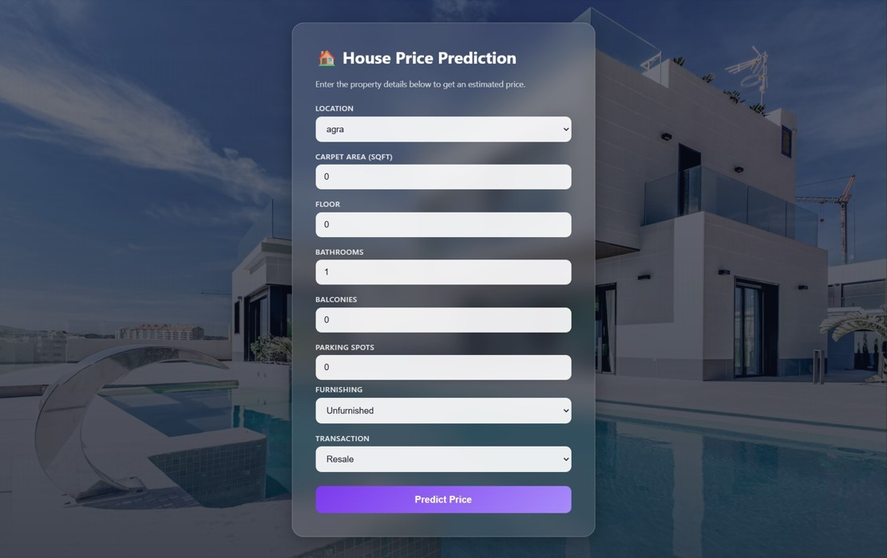

# House Price Prediction — End-to-End ML Web App

An end-to-end machine learning web app that predicts residential property prices in India.
The project goes from a raw, messy Kaggle dataset all the way to a deployed-style full-stack
application: a Jupyter notebook handles data cleaning and model training, a FastAPI backend
serves the trained model, and a React + TypeScript frontend lets a user enter property details
and see a predicted price.

## Overview

- **Dataset:** [House Price](https://www.kaggle.com/datasets/juhibhojani/house-price) by Juhi
  Bhojani on Kaggle — ~187,000 real property listings from India.
- **Notebook:** cleans messy text-encoded columns (price, area, floor, etc.), engineers
  features, compares 4 regression models, and exports the winning model.
- **Backend:** FastAPI service that loads the exported model once at startup and serves
  predictions over a REST API.
- **Frontend:** React + TypeScript form where a user enters property details and is shown a
  formatted predicted price.

## Architecture

```
┌─────────────────┐      HTTP POST /predict      ┌──────────────────┐      .predict()      ┌─────────────────────┐
│   React + TS     │ ────────────────────────────▶│   FastAPI        │ ───────────────────▶│  scikit-learn        │
│   Frontend        │                              │   Backend         │                      │  Pipeline (.pkl)      │
│   (localhost:5173)│ ◀──────────────────────────── │   (localhost:8000)│ ◀─────────────────── │  Random Forest model  │
└─────────────────┘      JSON: predicted_price     └──────────────────┘      float prediction  └─────────────────────┘
                                                              │
                                                              │ trained & exported by
                                                              ▼
                                                  ┌──────────────────────┐
                                                  │ Jupyter Notebook      │
                                                  │ (cleaning, EDA,       │
                                                  │  model comparison)    │
                                                  └──────────────────────┘
```

## Tech Stack

| Layer | Technology |
|---|---|
| Data & Modeling | Python, pandas, scikit-learn, matplotlib, seaborn, joblib |
| Backend | FastAPI, Pydantic, Uvicorn |
| Frontend | React, TypeScript, Vite, React Router |
| Model | Random Forest Regressor (scikit-learn `Pipeline`) |

## Project Structure

```
house-price-prediction-app/
├── house_price_model.ipynb   # Data cleaning, EDA, model training & export
├── house_price.pkl           # Exported model (duplicate of backend/models copy)
├── locations.json            # Allowed location list (duplicate of backend copy)
├── backend/
│   ├── app/
│   │   ├── main.py                     # FastAPI app, CORS, startup model loading
│   │   ├── api/routes/prediction.py    # GET /health, POST /predict
│   │   ├── core/config.py              # Settings (CORS origins) from .env
│   │   ├── schemas/prediction.py       # PredictionRequest / PredictionResponse
│   │   └── services/
│   │       ├── preprocessing.py        # Request → one-row DataFrame
│   │       └── inference.py            # Load .pkl, run predict
│   ├── models/house_price.pkl          # Trained pipeline (preprocessing + model)
│   ├── locations.json                  # Allowed location values (for the frontend)
│   ├── tests/test_prediction.py        # pytest tests (happy path + 422 case)
│   ├── requirements.txt
│   └── .env.example
└── frontend/
    ├── src/
    │   ├── api/predictionClient.ts     # fetch wrapper, base URL from env
    │   ├── components/PredictionForm.tsx
    │   ├── pages/HomePage.tsx | ResultPage.tsx | NotFoundPage.tsx
    │   ├── types/prediction.ts         # TS types mirroring the backend schema
    │   ├── locations.json              # Copy used to populate the dropdown
    │   └── App.tsx                     # Routes: / , /result , * (404)
    └── .env.example
```

## Dataset

**Source:** [House Price by Juhi Bhojani](https://www.kaggle.com/datasets/juhibhojani/house-price) on Kaggle.

The raw CSV is **not committed** to this repository (it's excluded via `.gitignore`, and is too
large to track in git). To reproduce the notebook:

1. Download the dataset from the Kaggle link above (or use the Kaggle CLI: `kaggle datasets
   download -d juhibhojani/house-price`)
2. Unzip it and place `house_prices.csv` in a `data/` folder next to the notebook
3. Run the notebook top to bottom (`Kernel → Restart & Run All`)

## Model

Four regression models were trained and compared on an 80/20 train/test split. Random Forest
was chosen as the final model, with hyperparameters (`n_estimators=150`, `max_depth=25`,
`min_samples_leaf=2`) deliberately constrained to keep the exported file size deployable
(36.6 MB) with negligible accuracy loss versus an unconstrained version (which scored
marginally higher but exported to 740 MB).

| Model | MAE | RMSE | R² | Train time |
|---|---|---|---|---|
| **Random Forest (final)** | **1,292,418** | **3,629,590** | **0.897** | 141.4s |
| KNN (k=10) | 1,447,930 | 4,138,094 | 0.866 | 0.5s |
| Decision Tree | 1,428,934 | 4,461,164 | 0.844 | 19.1s |
| Linear Regression | 4,321,293 | 6,607,670 | 0.658 | 1.2s |

5-fold shuffled cross-validation confirmed the result generalizes reliably: R² ranged from
0.891–0.905 across folds (mean 0.898, std 0.005), closely matching the single-split test R² of
0.897.

All preprocessing (imputation, scaling, one-hot encoding) is bundled inside the exported
scikit-learn `Pipeline`, so the backend never has to duplicate any encoding logic.

## Backend Setup

```bash
cd backend
python -m venv .venv
source .venv/bin/activate      # macOS/Linux
# .venv\Scripts\activate       # Windows

pip install -r requirements.txt
```

Copy the environment example and adjust if needed:
```bash
cp .env.example .env
```

Run the server:
```bash
uvicorn app.main:app --reload
```

The API will be live at `http://localhost:8000`, with interactive docs at
`http://localhost:8000/docs`.

Run the tests:
```bash
python -m pytest
```

### Backend environment variables

| Variable | Description | Example |
|---|---|---|
| `CORS_ORIGINS` | Allowed origins for cross-origin requests from the frontend | `["http://localhost:5173"]` |

## Frontend Setup

```bash
cd frontend
npm install
```

Copy the environment example and adjust if needed:
```bash
cp .env.example .env
```

Run the dev server:
```bash
npm run dev
```

The app will be live at `http://localhost:5173`.

### Frontend environment variables

| Variable | Description | Example |
|---|---|---|
| `VITE_API_BASE_URL` | Base URL of the running backend API | `http://localhost:8000` |

## API Reference

### `GET /health`

Health check.

**Response**
```json
{ "status": "ok" }
```

### `POST /predict`

Returns a predicted price for the given property details.

**Request body**
```json
{
  "carpet_area_sqft": 1200,
  "floor_num": 3,
  "bathroom_num": 2,
  "balcony_num": 1,
  "parking_count": 1,
  "Transaction": "Resale",
  "Furnishing": "Semi-Furnished",
  "facing": "East",
  "Ownership": "Freehold",
  "parking_type": "Covered",
  "location_grouped": "mumbai",
  "overlooks_main_road": 0,
  "overlooks_garden_park": 1,
  "overlooks_pool": 0
}
```

**Response**
```json
{ "predicted_price": 48012500.0 }
```

**curl example**
```bash
curl -X POST http://localhost:8000/predict \
  -H "Content-Type: application/json" \
  -d '{
    "carpet_area_sqft": 1200,
    "floor_num": 3,
    "bathroom_num": 2,
    "balcony_num": 1,
    "parking_count": 1,
    "Transaction": "Resale",
    "Furnishing": "Semi-Furnished",
    "facing": "East",
    "Ownership": "Freehold",
    "parking_type": "Covered",
    "location_grouped": "mumbai",
    "overlooks_main_road": 0,
    "overlooks_garden_park": 1,
    "overlooks_pool": 0
  }'
```

Invalid input (e.g. a non-numeric `carpet_area_sqft`) returns a `422 Unprocessable Entity`
with a Pydantic validation error body.

## Running the Full App

1. Start the backend (`uvicorn app.main:app --reload` from `backend/`) — leave it running
2. Start the frontend (`npm run dev` from `frontend/`) — leave it running
3. Open `http://localhost:5173` in your browser
4. Fill in the property details and click **Predict Price**
5. The predicted price is shown on the result page

## Screenshots

### Prediction form


### Prediction result

